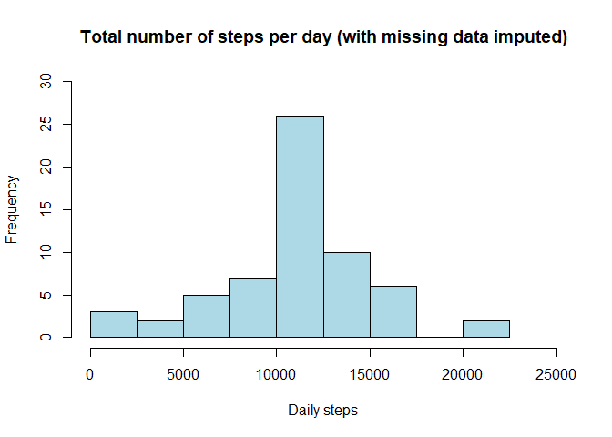

---

The data for the assignment can be downloaded [here](https://d396qusza40orc.cloudfront.net/repdata%2Fdata%2Factivity.zip). 

The variables included in this dataset are:

- steps: Number of steps taking in a 5-minute interval (missing values are coded as NA)  
- date: The date on which the measurement was taken in YYYY-MM-DD format  
- interval: Identifier for the 5-minute interval in which measurement was taken  

The dataset is stored in a comma-separated-value (CSV) file and there are a total of 17,568 observations in this dataset.

---


### Loading and preprocessing the data  

Show any code that is needed to  
1. Load the data (i.e. read.csv())  
2. Process/transform the data (if necessary) into a format suitable for your analysis  

<br>


```r
# First load R packages
library(ggplot2)
library(dplyr)
library(lubridate)

# Then load the data
activity <- read.csv("C:/Users/Neel/Desktop/RepData_PeerAssessment1/activity.csv")

# View the first 6 set of values
head(activity)
```

```
##   steps       date interval
## 1    NA 2012-10-01        0
## 2    NA 2012-10-01        5
## 3    NA 2012-10-01       10
## 4    NA 2012-10-01       15
## 5    NA 2012-10-01       20
## 6    NA 2012-10-01       25
```

```r
# Transform the date column and remove missing values
activity$date <- as.Date(activity$date)
act <- subset(activity, !is.na(activity$steps))
```

Summary of the data:

```r
summary(act)
```

```
##      steps             date               interval     
##  Min.   :  0.00   Min.   :2012-10-02   Min.   :   0.0  
##  1st Qu.:  0.00   1st Qu.:2012-10-16   1st Qu.: 588.8  
##  Median :  0.00   Median :2012-10-29   Median :1177.5  
##  Mean   : 37.38   Mean   :2012-10-30   Mean   :1177.5  
##  3rd Qu.: 12.00   3rd Qu.:2012-11-16   3rd Qu.:1766.2  
##  Max.   :806.00   Max.   :2012-11-29   Max.   :2355.0
```

---

### What is mean total number of steps taken per day?  

*For this part of the assignment, you can ignore the missing values in the dataset.*  
1. Calculate the total number of steps taken per day  
2. Make a histogram of the total number of steps taken each day  
3. Calculate and report the mean and median total number of steps taken per day  

<br>

**1. Number of steps per day**

```r
StepsPerDay <- aggregate(act$steps, list(act$date), FUN=sum)
colnames(StepsPerDay) <- c("Date", "Steps")
StepsPerDay
```

```
##          Date Steps
## 1  2012-10-02   126
## 2  2012-10-03 11352
## 3  2012-10-04 12116
## 4  2012-10-05 13294
## 5  2012-10-06 15420
## 6  2012-10-07 11015
## 7  2012-10-09 12811
## 8  2012-10-10  9900
## 9  2012-10-11 10304
## 10 2012-10-12 17382
## 11 2012-10-13 12426
## 12 2012-10-14 15098
## 13 2012-10-15 10139
## 14 2012-10-16 15084
## 15 2012-10-17 13452
## 16 2012-10-18 10056
## 17 2012-10-19 11829
## 18 2012-10-20 10395
## 19 2012-10-21  8821
## 20 2012-10-22 13460
## 21 2012-10-23  8918
## 22 2012-10-24  8355
## 23 2012-10-25  2492
## 24 2012-10-26  6778
## 25 2012-10-27 10119
## 26 2012-10-28 11458
## 27 2012-10-29  5018
## 28 2012-10-30  9819
## 29 2012-10-31 15414
## 30 2012-11-02 10600
## 31 2012-11-03 10571
## 32 2012-11-05 10439
## 33 2012-11-06  8334
## 34 2012-11-07 12883
## 35 2012-11-08  3219
## 36 2012-11-11 12608
## 37 2012-11-12 10765
## 38 2012-11-13  7336
## 39 2012-11-15    41
## 40 2012-11-16  5441
## 41 2012-11-17 14339
## 42 2012-11-18 15110
## 43 2012-11-19  8841
## 44 2012-11-20  4472
## 45 2012-11-21 12787
## 46 2012-11-22 20427
## 47 2012-11-23 21194
## 48 2012-11-24 14478
## 49 2012-11-25 11834
## 50 2012-11-26 11162
## 51 2012-11-27 13646
## 52 2012-11-28 10183
## 53 2012-11-29  7047
```

**2. Histogram of the total number of steps taken per day**

```r
g <- ggplot(StepsPerDay, aes(Steps))
g + geom_histogram(boundary=0, binwidth=2500, col="blue", fill="lightblue") +
    ggtitle("Total number of steps per day") +
    xlab("Daily steps") + 
    ylab("Frequency") +
    theme(plot.title = element_text(face="bold", size=12)) +
    scale_x_continuous(breaks=seq(0,25000,2500)) +
    scale_y_continuous(breaks=seq(0,18,2))
```

<!-- -->

**3. Mean and median of total number of steps taken per day**

```r
# Mean:
mean(StepsPerDay$Steps, na.rm=TRUE)
```

```
## [1] 10766.19
```

```r
# Median:
median(StepsPerDay$Steps, na.rm=TRUE)
```

```
## [1] 10765
```

---

### What is the average daily activity pattern?  

1. Make a time series plot of the 5 minute interval (x) and averaged number of steps taken averaged across all days (y)  
2. Which 5-minute interval, on average across all the days in the dataset, contains the maximum number of steps?  

<br>

**1. Time series plot of the 5 minute interval (x) and averaged number of steps taken averaged across all days (y)**

```r
avStepsbyInterval<-aggregate(steps~interval, activity, mean)
with(avStepsbyInterval, 
     plot(interval, steps, type = "l", 
        main="Average number of steps per time interval",
        xlab="Time Interval",
        ylab="Average number of steps"))
```

<!-- -->

**2. Which 5-minute interval (on average across all the days) has the maximum number of steps**

```r
max_step_interval <- avStepsbyInterval[which.max(avStepsbyInterval[,2]),1]
max_step_interval
```

```
## [1] 835
```

The interval 835 has the maximum number of steps.

---

### Imputing missing values  

*Note that there are a number of days/intervals where there are missing values (coded as NA). The presence of missing days may introduce bias into some calculations or summaries of the data.*  
1. Calculate and report the total number of missing values in the dataset (i.e. the total number of rows with NAs)  
2. Devise a strategy for filling in all of the missing values in the dataset. The strategy does not need to be sophisticated. For example, you could use the mean/median for that day, or the mean for that 5-minute interval, etc.  
3. Create a new dataset that is equal to the original dataset but with the missing data filled in.  
4. Make a histogram of the total number of steps taken each day and Calculate and report the mean and median total number of steps taken per day. Do these values differ from the estimates from the first part of the assignment? What is the impact of imputing missing data on the estimates of the total daily number of steps?  

<br>

**1. Total number of missing values in the dataset**

```r
sum(is.na(activity$steps))
```

```
## [1] 2304
```
There are 2304 missing values in the dataset.  

**2. Filling in missing values**  
Using a simple strategy of filling in missing values for a 5-minute interval using the mean for that interval.

```r
imputed_steps <- function(interval){
    avStepsbyInterval[avStepsbyInterval$interval==interval,]$steps
}
```

**3. Creating a new dataset that is equal to the original dataset but with the missing data filled in**  
(Also need to round up the mean filled in values)

```r
activity_noNA <- activity
for(i in 1:nrow(activity_noNA)){
    if(is.na(activity_noNA[i,]$steps)){
        activity_noNA[i,]$steps <- round(imputed_steps(activity_noNA[i,]$interval))
    }
}
```

View the first 6 set of values in the new "filled in" dataset (activity_noNA)

```r
head(activity_noNA)
```

```
##   steps       date interval
## 1     2 2012-10-01        0
## 2     0 2012-10-01        5
## 3     0 2012-10-01       10
## 4     0 2012-10-01       15
## 5     0 2012-10-01       20
## 6     2 2012-10-01       25
```

**4a. Make a histogram of the total number of steps taken each day**

```r
new_total <- tapply(activity_noNA$steps, activity_noNA$date, sum, na.rm=TRUE, simplify = T)
hist(x=new_total,
     col="lightblue",
     breaks=seq(0,22500,2500),
     xlab="Daily steps",
     ylab="Frequency",
     main="Total number of steps per day (with missing data imputed)",
     xlim=c(0, 25000), 
     ylim=c(0, 30))
```

<!-- -->

**4b. Calculate and report the mean and median total number of steps taken per day**

```r
# Mean:
mean(new_total)
```

```
## [1] 10765.64
```

```r
# Median:
median(new_total)
```

```
## [1] 10762
```

The new mean with imputed data is 10766, which is the same as the mean calculated with missing data.  
The new median with imputed data is 10762, which is a few steps less than the median calculated with missing data of 10765.  
From comparing the histograms, it is possible to see the impact of imputing missing data since there is now a higher frequency of daily steps ranging between 10000 and 12500 steps.

---

### Are there differences in activity patterns between weekdays and weekends?  

*For this part the weekdays() function may be of some help here. Use the dataset with the filled-in missing values for this part.*  
1. Create a new factor variable in the dataset with two levels – “weekday” and “weekend” indicating whether a given date is a weekday or weekend day.  
2. Make a panel plot containing a time series plot of the 5-minute interval (x-axis) and the average number of steps taken, averaged across all weekday days or weekend days (y-axis). See the README file in the GitHub repository to see an example of what this plot should look like using simulated data.  

<br>

**1. Create a new factor variable in the dataset with two levels – “weekday” and “weekend” indicating whether a given date is a weekday or weekend day**

```r
# Create variable with date in correct format
activity_noNA$newDate <- as.Date(activity_noNA$date, format = "%Y-%m-%d")
# Create a variable with weekdays name
activity_noNA$weekday <- weekdays(activity_noNA$newDate)
# Create a new variable indicating weekday or weekend
activity_noNA$dayType <- ifelse(activity_noNA$weekday=='Saturday' | 
                         activity_noNA$weekday=='Sunday', 'weekend','weekday')
```

View the first 6 set of values in the new dataset that includes the new variables:

```r
head(activity_noNA)
```

```
##   steps       date interval    newDate weekday dayType
## 1     2 2012-10-01        0 2012-10-01  Monday weekday
## 2     0 2012-10-01        5 2012-10-01  Monday weekday
## 3     0 2012-10-01       10 2012-10-01  Monday weekday
## 4     0 2012-10-01       15 2012-10-01  Monday weekday
## 5     0 2012-10-01       20 2012-10-01  Monday weekday
## 6     2 2012-10-01       25 2012-10-01  Monday weekday
```

**2. Time series plot of the 5 minute interval (x) and averaged number of steps taken averaged across all weekday days or weekend days (y)**

```r
library(lattice)

day_activity <- aggregate(steps ~ dayType+interval, data=activity_noNA, FUN=mean)
xyplot(steps ~ interval | factor(dayType), 
       data= day_activity,
       type = "l", 
       layout = c(1, 2), 
       xlab="Interval", 
       ylab="Number of steps")
```

<!-- -->

From the panel plot, it is possible to see that there are more than 200 steps taken on weekdays per interval, compared to more than 150 steps taken on weekends per interval.
